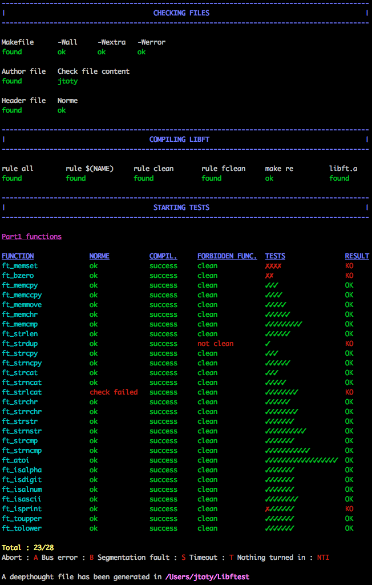

# PREAMBLE
This is an edit of prev libftest made by @jtoty to fit with the 2019 project libft. <br/>
(ORIGINAL REP : https://github.com/jtoty/Libftest) <br/>
This update was made by @lmartin <br/>

# libft-war-machine

## Example Library

This repository now includes a minimal example `libft` implementation with basic functions at the root level. You can use these files as a starting point for your own implementation or to understand how libft should be structured. The example includes:

- **libft.h**: Complete header file with all function prototypes
- **Makefile**: Standard makefile with all required rules (all, clean, fclean, re)
- **Implementation files**: 12 basic functions including:
  - String functions: `ft_strlen`, `ft_putstr_fd`, `ft_putendl_fd`
  - Memory functions: `ft_memset`, `ft_bzero`
  - Character checks: `ft_isalpha`, `ft_isdigit`, `ft_isalnum`, `ft_isascii`, `ft_isprint`
  - Output functions: `ft_putchar_fd`, `ft_putnbr_fd`

### Building the Example

To build the example library:
```bash
make
```

To clean up:
```bash
make clean    # Remove object files
make fclean   # Remove object files and library
make re       # Rebuild everything
```

### Using with the Testing Framework

To test these example files with the framework:
1. Update `my_config.sh` and set `PATH_LIBFT` to this directory:
   ```bash
   PATH_LIBFT="/path/to/libmachine"
   ```
2. Run the test script for specific functions:
   ```bash
   bash grademe.sh ft_strlen
   ```

Or copy the example files to your own libft project directory and point `PATH_LIBFT` there.

## Testing the Framework

This repository contains script to test your libft project.
The script will do the following tests :

- Check if the author file exists
- Check content of the author file
- Check if libft.h exists
- Check norme of libft.h
- Check if the Makefile file exists
- Check rules in Makefile
- Check compilation's flag in Makefile
- Compil library
- Check norme errors
- Check forbidden functions
- Tests functions

At the end of the tests, a deepthought file will be created, inside which you
can find all the results and error/failure messages. You can also see your
results in tests directory.

The script will compil your files with your libft, so you must have your
Makefile up to date.

:warning:All the tests made are not the official tests:warning:

## Getting Started

### Installation

```bash
git clone https://github.com/y3ll0w42/libft-war-machine
```

### Configuration

If you run the script for the first time, it will automatically create
`my_config.sh` file and ask you to edit it with the path of your libft
project.
You can also choose the colors that will be used and the path where the
deepthought file will be created.

#### Custom directories

If you use custom directories for your header and source files; you should specify there name in my_config.sh.

The following variables must be set:
```
HEADER_DIR
SRC_DIR
```
Exemple:
```
HEADER_DIR="includes"
SRC_DIR="srcs"
```


## Running script

Go to the directory where you cloned and run the script
```bash
bash grademe.sh
```
or simply run the script with the path
```bash
bash /path/where/you/cloned/grademe.sh
```

### Options available
| Option | Description |
| --- | --- |
| `-h`<br />`--help` | Display help and exit |
| `-d` | Allows to perform the tests even if the files are in directories |
| `-c` | Disable color |
| `-s` | Disable searching Makefile and author files |
| `-m` | When compiling library, test all the Makefile's rules (instead of doing only make re and checking if other rules exist). |
| `-l` | Disable compiling library |
| `-f` | Disable checking forbidden functions |
| `-n` | Disable norminette |
| `-u` | Disable checking updates at launch |
| `-p1` | Disable part 1 tests |
| `-p2` | Disable part 2 tests |
| `-b`| Disable bonus part tests |
| `-a` | Disable additional part tests |
| `-op1`| Do only part 1 tests |
| `-op2`| Do only part 2 tests |
| `-ob` | Do only bonus part tests |
| `-oa` | Do only additional part tests |
| `ft_function` | Test only this function |

Add successively all options you want, in the order you want.
For example :
```bash
bash grademe.sh ft_atoi -f ft_strlen -n
```

### Supported functions
All the supported functions are listed [on this page](https://github.com/y3ll0w42/libft-war-machine/blob/master/supported_functions.md).
## Contribution

Any suggestions or bugs reporting ?
Contact lmartin@student.42.fr

### Contributors
- jtoty : https://github.com/jtoty
- jmichaud : https://github.com/MrJe
- tlernoul
